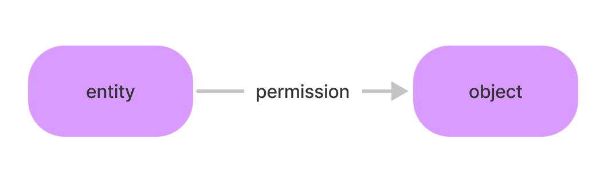

# RBAC is Dead, Long Live ReBAC.

## Why ReBAC?

Like many developers, I found myself implementing access control in one of my projects. My code looked roughly like this:

```js
// First check if they are invited explicitly
let role = await getUserInvited(user.Org, resource.ID) // database call

if (role && [
      "viewer",
      "writer",
      "editor",
      "editor",
      "admin",
      "viewer"
    ].includes(role)) {
    // They can view
}

if (resource.Org == user.Org) {
  // Check if they are part of the owning organization
  role = await getUserOrgRole(user.ID) // database call
  if (role && [
        "viewer",
        "writer",
        "editor",
        "editor",
        "admin",
        "viewer"
      ].includes(role)) {
    // They can view
  }
}

// They cannot view
```

When I really thought my code could look like this:

```js
if (await client.CheckPermission(user.ID, "VIEW", resource.ID).valid) {
  // They can view
} else {
  // They cannot view
}
```

To do a certain action, I wanted to only check if the user could perform THAT action, I didn't need to know anything else.

After researching, it was clear that ReBAC was the solution.

Looking at existing open source solutions like SpiceDB, Cerbos, and Oso, the efforts to learn and maintain such a system seemed no more fruitful than my long code...

I didn't want to learn someone else's schema and definition language just so I could reduce a few lines of code down to a few less. That seemed like an enormous waste of time.

There was also Ory Keto, but it's in such early access, and still seemed overly complex to both configure and use.

I didn't want to write schemas, entity definitions, or anything like that, I just wanted to know if this user could `VIEW` the resource it was requesting. That didn't seem like a lot to ask for.

Why is this so hard? I know lots of other developers that had to solve permissions and access control in their projects, what do they do? I decided to ask some fellow developers on how they implemented access control in their products.

The answer, lots of custom code. Some built extensive conditional statements like mine, some built their own ReBAC solutions specific to their needs, **but everyone spent a lot of time yak shaving to build their permissions systems with the same thought: "None of the existing solutions are any easier to learn or use than writing it myself."**

This issue kept bothering me, since I knew us developers wanted to spend less time on permissions and more time on the core functionality of what we were creating.

I asked myself:

> What if I could set and check permissions with one line of code?
>
> What if there was a solution that solves the challenges existing solutions attempt to, but is accessible to every developer?
>
> What if there was a solution that scales with the app it protects, and has the flexibility to fit nearly any access control requirement?
>
> What if permissions was the most simple part of any code base, and as easy to use as any other package?

I knew there had to be a better way, and I wanted to make it.

This is how my journey into ReBAC and access control began, and why I built [Permission Panther](https://github.com/TheSaaSZoo/PermissionPanther).

But before we talk about [Permission Panther](https://github.com/TheSaaSZoo/PermissionPanther), first let's talk about what ReBAC is.

## A simple way think about ReBAC is: RBAC per resource.

In fact this is actually how Kubernetes uses it. They call it RBAC, but it’s actually ReBAC (since it is per resource, but I am still inclined to call it RBAC due to how simple the permissions are).

When Google introduced Zanzibar in 2019, they gave us a look under the covers on how their most extreme services like Google Drive are able to handle billions of users while offering highly expressive permissions for individual documents, folders, shared drives, and entire organizations.

So yeah, ReBAC can do everything that RBAC can do, but also far more, and using less code.

## In Order to Understand ReBAC, We Have to Understand 3 Simple Components: Entities, Permissions, and Objects

While these three components have different names depending on the implemenation, and may be abstracted to higher level components, the functionality is the definition of ReBAC.

### Entities

When we give someone a permission to something, the “someone” is an entity. For example, a GitHub user.

### Permissions

We need to define what an entity can do to an object, and that’s where the permission comes in. For example, some permissions might be `view`, `write`, `delete`.

### Objects

The thing we are giving a permission for. For example, a GitHub repository.

## Relations

Entities, Permissions, and Objects come together to form a **Relation**, the foundation of relationship-based access control. Going forward we will do this in the format of `(entity, permission, object)`.

In its simplest form, a Relation joins an `entity` and `object` with a `permission` like so:



Following this graph of relations is how we find who has a `permission` on what. If there is not a specifically named arrow (`permission`) connecting the `entity` and `object`, then they implicitly do not have the `permission` on that `object`.

For example, we might give a user access to view a private GitHub repo with the relation `(user_id, read, repo_id)`:


## ReBAC Enables Functionality Not Found In Other Authorization Systems

Some of the most important features are **inheritance, fine-grained permissions, permission groups, and future-proofing.**

### Inheritance

Inheritance gives ReBAC the ability to allow entity-object relations to be inherited by other objects. Using the format above, we might have a GitHub org of `my awesome org`, and a repo inside that org called `bug-free code`.

In order to give everyone in the GitHub org the default permission to view all of its repositories, we can create the following set of relations:

Every time a user is added to the org, we create the relation `({new_user}, read, my awesome org)`.

Now, when ever we create a repo inside that org, we only need to create the relation `(~read#my awesome org, read, {new repository})`. The entity `~read#my awesome org` converts to “any entity that has the `read` permission on the object `my awesome org`. **In effect, the new repository inherits read permissions from the org.**

### Fine-grained Permissions

Creating a simple set of roles such as `read`, `write`, and `owner` for something like a GitHub repo is insufficient for all of the features provided.

Think about how GitHub manages permissions for public and private repos, access to repos within orgs, permission by branch, or access to run GitHub actions.

For example, when branch protections are enabled for the `main` branch, by default nobody can write to it. Instead, users with write permissions have to be listed. This relation might look like: `({user_id}, write, my_repo#branch#main)`.

The object `my_repo#branch#main` scopes down to a specific branch in a specific repo.

### Permission Inheritance

RBAC has no natural sense of permission inheritance. For example, if you want to combine `read` and `write` access to an `editor` and `owner` role, then your application needs to know the order of permissions to check (first check if a user has `read`, if not check whether they have `commentor`, if not check whether they have `editor`, if not check whether they have `owner`).

Existing implementations of ReBAC include permission based inheritance as well, but this comes at the expense of complex schema crafting.

A simpler approach is to expand a special permission into multiple, [this is how Permission Panther approaches this requirement, with "Permission Groups"](/docs/getting-started/concepts#permission-groups) so that we don't need complex schemas for simple expressions.

One might consider this a "role", however an inline RBAC solution could require a preposterous amount of changes to a code base to add another permission or role. By simply modifying the permissions that a Permission Group expands to, without a single code change we can enable existing Permission Groups to inherit new permissions for recently added features, while having the flexibility to require new permissions for them as well.

This is where ReBAC can do everything that RBAC can do.

Nobody wants to write code that looks like:

- Are they a `VIEWER`? If not...
- Are they a `COMMENTOR`? If not...
- Are they a `EDITOR`? If not...
- Are they an `ADMIN`? If not...
- Are they an `OWNER`? If not...
- Are they a `VIEWER` of the folder? If not...
- Are they a `COMMENTOR` of the folder? If not...
- Are they a `EDITOR` of the folder? If not...
- Are they an `ADMIN` of the folder? If not...
- Are they an `OWNER` of the folder? If not...
- Are they a `VIEWER` of the owning organization? If not...
- Are they a `COMMENTOR` of the owning organization? If not...
- Are they a `EDITOR` of the owning organization? If not...
- Are they an `ADMIN` of the owning organization? If not...
- Are they an `OWNER` of the owning organization? If not...
- They don't have access

Don't let you code look like this when it could look like:

- Does the user have `VIEW`? If not...
- They don't have access

**That's it, no matter how many Permission Groups/Roles or unique permissions exist, you can always check the same permission for an action.**

### Future-Proofing, sort of...

Since the three components, `entity`, `permission`, and `object` can be any arbitrary data, this gives us the functionality to add future features without making any changes to our authorization system.

Let’s say that when GitHub decided to add their new Codespaces, they had previously had a auth system that was hard-coded to repos and organizations. This would have been a nightmare for the engineering team to either add in another system for Codespaces, or re-write the system to use ReBAC instead.

With ReBAC, access controls for Codespaces are as simple as another relation tuple. Imagine you have a Codespace, and you want to invite one of your colleagues to code with you, but not give them access to the terminal. This can be expressed with the relation tuple `(colleague_user_id, code, codespace_id)`. By specifying the `code` permission, we only give them access to edit code. If we want to give them access to the terminal later, we can create another tuple where the permission is `terminal`.

What if we wanted to enable all maintainers to create Codespaces while both having the granularity of the `create_codespace` permission, but without having to find all maintainers and update their permissions? A simple Permission Group would only require we simply add the `create_codespace` permission to the group.

## To understand the needs for ReBAC, let’s look at an example we are all intimately familiar with: Google Drive.

_If you understand ReBAC at this point, feel free to skip this section._

Say you’ve got an English paper to write with a group of classmates. You create the Google Doc, and invite your classmates to work on it with you. Because this Google Doc was created by you, we initially create the relation `(you, #owner, your_google_doc)` to establish you as the owner. The `#owner` Permission Group gives you access to not only `read` and `write`, but to `delete`, `invite`, and `move` the file.

Now we send out a few invites that look like (`{group member email}`, `#editor`, `your_google_doc`). This gives your group members the ability to edit that Google Doc. Now they can `read`, `write`, and `comment` through the `#editor` Permission Group.

The paper is now due, and your professor has asked every group to pair with another to peer review everyone’s papers. Rather than print multiple copies of each paper to give to reviewers like it’s 2003, you instead invite those reviewers to have the `#commenter` permission group, like `({reviewer}, #commenter, your_google_doc)`. The `#commenter` Permission Group might expand to `read` and `comment`, since there is no reason they need to `write`.

After grading, your professor decides that these will be your groups for all assigments for the rest of the semester. Since you are going to be getting a lot of assignments, you now create a folder for all of your assignments, and give your group members permission to edit the folder, thus the permission to edit everything inside.

This is where we can deploy **inheritance.** In order to do this with relations, let’s create the relation between all your group mates and that folder: `({group member email}, #editor, your_folder)`. Now every time a new item is created, or put in that folder, **we only have to make the relation** `(~editor#your_folder, #editor, {new_file})`.

In this relation, `~editor#your_folder` is a new entity format that means **“anyone who has the `#editor` permission on the object `your_folder`”**. This relation now allows all new files to inherit previously established editor permission grants from the folder!

Since you will be given a random peer review group for every assignment, you will still be leveraging the relations to individual files for `#commenter` access, rather than the entire folder.

Yes, the admin panel for your Raspberry Pi temperature sensor can work just fine with `viewer` and `admin` privileges (the object you are giving permission for is implicitly the temperature sensor), but simple RBAC does not suffice for platforms like Google Drive. If you are an `#editor`, you have to be an editor of **something**. We need to have **relations** between our entities, permission, and objects.

This is a super simple example, but ReBAC usage gets far more complex, but it can also get more simple.

**In summary, ReBAC includes important features over RBAC:**

- **Inheritance** - “Who ever has the `editor` permission of this folder, also has the `editor` permission for all files inside that folder”, or "Who ever is an `editor` can `read`, `write`, etc."
- **Fine-grained Scoping and Future-proofing** - Since an `object` can be anything, we can reduce permissions down to what ever access level we want, or anything we want, without changing the way our code works.

## The problem with existing ReBAC solutions: they’re overly complex

There are a few solutions out there the solve the ReBAC problem: SpiceDB, Ory Keto, Cerbos, and Warrant being some of them. I believe they all fall short in making ReBAC accessible to developers.

With SpiceDB, you need a masters degree in computer science to understand their schema definition language. [Tell me if this is something you can drop in your app easily](https://docs.authzed.com/guides/schema).

Ory Keto is in early access, looks to stay that way for a while, and is not cared for like the rest of the Ory products.

With Warrant, you still need to define both [object schemas](https://docs.warrant.dev/quickstart/creating-object-types) as well as [create users](https://docs.warrant.dev/quickstart/creating-users) (further complicating your registration flow), [and their pricing model is insulting.](https://warrant.dev/pricing) It would be cheaper to build a custom solution at that price.

With Cerbos you still need to [define complex schemas](https://docs.cerbos.dev/cerbos/latest/policies/schemas.html), and are forced to host it yourself. They call it _"Painless access control for cloud-native applications"_, but [this looks pretty painful to learn to me](https://play.cerbos.dev/p/bvcxiZY0610b114aig5k1vsm6YPvO5X8).

With Oso, again, we need to [learn a new schema definition language, "polar"](https://docs.osohq.com/getting-started/quickstart.html#3-update-the-policy)... the pattern among these solutions is quite apparent.

I appreciate the effort of these companies to solve access control. However these solutions "solve" the problem in such a way that is inaccessible for those who don't already understand ReBAC. They provide a solution to ReBAC experts who don't want to continuously re-write ReBAC solutions, but miss the mark on making it available all developers. In effect, the level of complexity to setup properly, and the required knowledge to use, result in gate-keeping access control solutions.

So they solve the problem for fellow access control experts, not for everyone else.


## Introducing Permission Panther!

_You Never Saw This Coming..._

I’m super excited to announce Permission Panther - The Permissions Platform For Killer Apps.

I wanted to build a permissions solution for devs who wanted to spend less time on permissions, and more time on their apps.

The goal of Permission Panther was super simple:

1. Build ReBAC in such a way that any developer can implement it in minutes, not days
2. ReBAC without schemas or entity definitions, while enabling inheritance for permission and objects
3. The ability to list relations in both directions: What objects does an entity have permissions on? And what entities have permissions on this object?
4. Open source, host it yourself with just a single binary/container, and a few environment variables!
5. [A managed offering](https://permissionpanther.com) with pricing that any project can afford (that means really generous free usage, and really scalable pricing)

**Some Feature Coming Soon:**

- Relation TTLs - automatically expire a relation after a certain amount of time. Useful if you want to give support agents temporary access to customer data, or if you only want certain personnel to have access to a given part of a building for the day.
- Wildcard support for entities, permissions, and objects - functionality is done and tested, just not exposed as I am still exploring how developers might want to access this, balancing performance costs and under-opinionating systems
- Multi-region projects (store relation tuples in the region closest to where they are most frequently accessed)
- Recursion caching - if a user has access to a document that’s in 30 nested folders, we don’t want to run 30 recursive checks every time. Intelligent caching that will resolve these to single KV lookups while also being able to purge the cache when the inheritance chain might have been modified.
