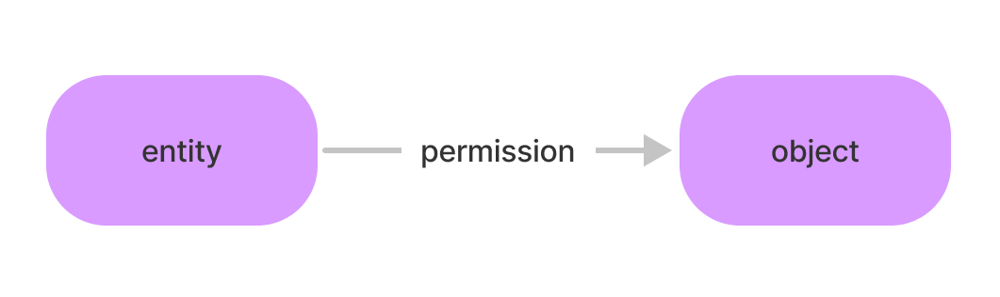

# Concepts

Permission Panther keeps permissions extremely simple, but there are a few thing you might want to familiarize yourself with before jumping in:

## ReBAC vs. RBAC

**RBAC**, or Role-Based Access Control is a method of authorizing users by their role.

For example someone might be a 'user', 'admin', or 'owner'.

RBAC has many limits:

1. It doesn’t scale
2. Roles are too permissive and don’t allow for fine-grained control
3. Users and Roles are implicit, which constrains available use cases

**ReBAC**, or Relationship-Based Access Control is a method of authorizing users by what permissions they have on an individual object. This is done with [Relations](#relations) (see below).

ReBAC has many advantages over RBAC:

- **Inheritance** - “Who ever has the `editor` permission of this folder, also has the `editor` permission for all files inside that folder”, or "Who ever is an `editor` can `read`, `write`, etc."
- **Fine-grained scoping and future-proofing** - Since an `object` can be anything, we can reduce permissions down to what ever access level we want, or anything we want, without changing the way our code works.
- **Always check for the same permission** - If you are checking if someone can view something, always check for the `view` permission. No more checking lots of potential roles and conditions that could change over time.
- **Everything RBAC can do, and more** - With Permission Groups, you can define roles that inherit a set of permissions. Now you have all the features of RBAC, with so much more, without having to check multiple roles for a certain action.

Check out [this blog post](/blog/rbac-vs-rebac) for more details about how RBAC and ReBAC differ.

## Relations

Relations link an `entity` to an `object` by a `permission`. This is the basic building block of ReBAC, as it allow us to be extremely granular and expressive with our permissions. They are usually in the form of a tuple like:

```
(entity, permission, object)
```

In its most simple form, a Relation joins an `entity` and `object` with a `permission` like so:



Following this graph of relations is how we find who has a `permission` on what. If there is not a specifically named arrow (`permission`) connecting the `entity` and `object`, then they implicitly do not have the `permission` on that `object`.

### Entity

The `entity` is the thing you are giving a `permission` to, usually a user or service account, but could also be a sentient doughnut if that's what you're working with. You can put any string in the `entity` field that starts with a letter less than ASCII code `~`, since that is how we encode inheritance.

### Permission

A `permission` is the action that you are permitting (or explicitly denying) on an `object`. For example a `permission` might be `READ`, `DELETE`, `INVITE`, `UPLOAD`, etc. You can put any string in the `permission` field except for string that start with `$`, since that is how we encode permission groups.
### Object

An `object` is what you give permission to. This might be a project namespace, a git repo, a physical door, or a row in a database.


For example, if we wanted to give the user `example_user` permission to `READ` the a file with the ID `my_awesome_file`, that might look like:

```
("example_user", "READ", "my_awesome_file")
```

In Permission Panther, using the NodeJS client library, that would look like:

```js
await client.SetPermission("example_user", "READ", "my_awesome_file")
```

Now we can check it:

```js
const check = await client.CheckPermission("example_user", "READ", "my_awesome_file")
console.log(check.valid)
// true
```

A lack of a relation is an implicit denial, so you can be assured that users only have access if we have declared it so.

## Inheritance and Recursion

**Inheritance** allows you to simplify the graph of relations by inheriting permissions from another object.

The best want to explain this is with an example: Think of a Git Repository management product where we want to have organizations that permit all members to be viewers of repositories owned by the organization.

This is accomplished by creating an **Inheritance** relation.

First, we want to ensure that users are members of a given organization with the relation:

```js
await client.SetPermission("user_a", "MEMBER", "org_a")
```

Next, we want to make an an **Inheritance** relation that permits anyone who is a `MEMBER` of the owning organization can `VIEW` a given repository. We can do this by using a special entity that will define this relation as an **Inheritance** relation.

```js
await client.SetPermission(client.Inherit("MEMBER", "org_a"), "VIEW", "repo_a")
```

This relation simply says:

> Whoever is a `MEMBER` of `org_a`, can `VIEW` `repo_a`

Permission Panther knows by this special entity scheme that it needs to look at who is a `MEMBER` on `org_a` to determine if if the user has permission.

Now, we can check if a given user has `VIEW` on a repository:

```js
await client.CheckPermission("user_a", "VIEW", "repo_a")
// {valid: true}
```

:::caution
**Inheritance** incurs **recursion**, which means that for every nested inheritance relation, Permission Panther checks for whether the user has permission through that inheritance relation, or checks whether there are more nested inheritance relations to look through, until it hits `max_recursion` or finds the relation.
:::

Permission Panther uses a `max_recursion` per API Key that allows you to granularly control which keys are allowed to recurse how many times.

The impact of recursion is a factor of how many nested inheritance relations you have, and the latency of your database queries.

Each recursion of an inheritance check should take (in the common case), 1-3ms. Permission Panther does nested inheritance relation checks concurrently, so ensuring that you have enough query bandwidth to perform highly nested checks will keep your latency low.

## Permission Groups

Sometimes individual permissions are too specific, and you might want to give a user a set of permissions instead, or a "group". This is where ReBAC inherits the main appeal of RBAC.

For example, what if we wanted to give a `MAINTAINER` permission to all repositories that allowed them to `VIEW`, `WRITE`, `CREATE_PR`, `APPROVE_PR`, and more?

Rather than making many inheritance relations for each permission and repository, we can define a [Permission Group](#permission-groups) that includes multiple permissions under one.

Nobody wants to write code that looks like:

- Are they a `VIEWER`? If not...
- Are they a `MAINTAINER`? If not...
- Are they an `ADMIN`? If not...
- Are they an `OWNER`? If not...
- Are they a `VIEWER` of the owning organization? If not...
- Are they a `MAINTAINER` of the owning organization? If not...
- Are they an `ADMIN` of the owning organization? If not...
- Are they an `OWNER` of the owning organization? If not...
- They don't have access

Don't let you code look like this when it could look like:

- Does the user have `VIEW`? If not...
- They don't have access

**That's it, no matter how many Permission Groups or unique permissions exist, you can always check the same permission for an action.**


First we define the Permission Group:

```js
await client.CreatePermissionGroup("MAINTAINER", ["VIEW", "WRITE", "CREATE_PR", ...])
```

This simply creates a shortcut that says:

> When I give someone `MAINTAINER`, give them `VIEW`, `WRITE`, `CREATE_PR`, etc.

Now, when we create the inheritance relation we can reference the Permission Group as the permission:

```js
await client.SetPermission(client.Inherit("MEMBER", "org_a"), client.PermissionGroup("MAINTAINER"), "repo_a")
```

This one line of code says:

> Whoever is a `MEMBER` of `org_a`, can `VIEW`, `WRITE`, `CREATE_PR`, etc. on `repo_a`

If a user wants to create a pull request on the repository, we can now check the following:

```js
await client.CheckPermission("user_a", "CREATE_PR", "repo_a")
// {valid: true}
```

We can also check whether the user belongs to this permission group:

```js
await client.CheckPermission("user_a", client.PermissionGroup("MAINTAINER"), "repo_a")
// {valid: true}
```

:::note
Nested Permission Groups are not currently supported. This functionality is target for a future release.
:::
